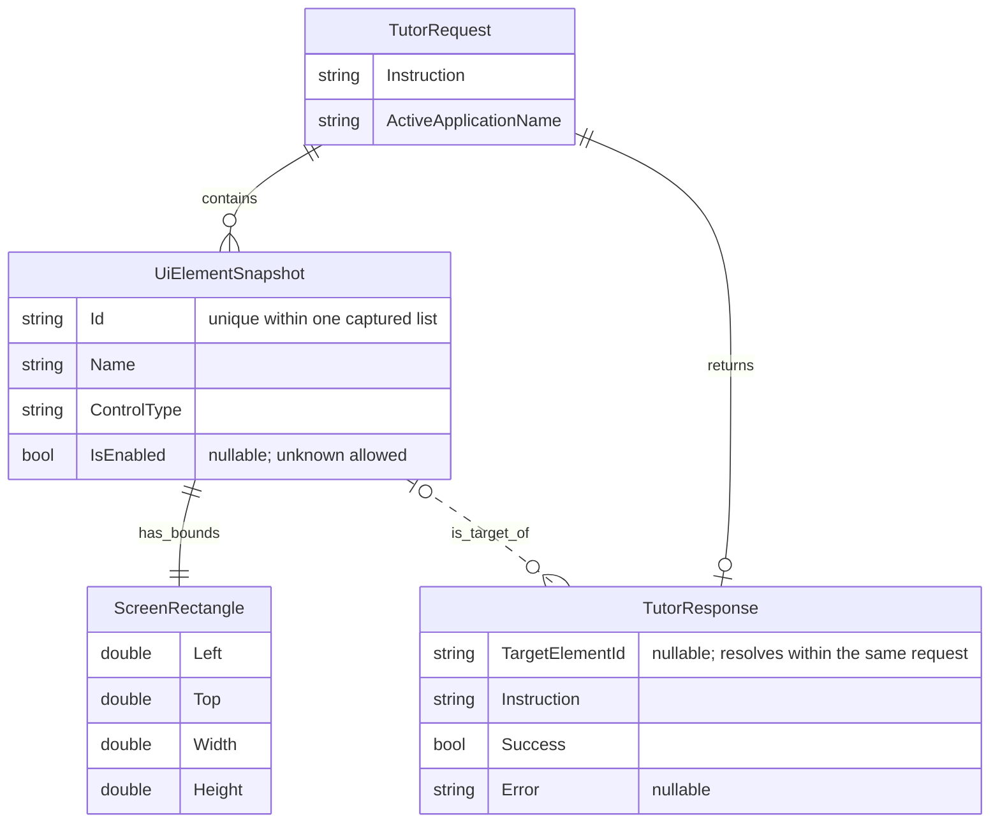

# Data model and ERD

This is a **logical entity relationship diagram** of the tutoring data in memory. It describes the existing [Core DTOs](../src/LocalTutor.Core/TutorContracts.cs), not database tables. A DTO (data transfer object) carries named values between components. No database, migrations, persistent user profiles, or conversation storage is needed for this MVP.

## Tutoring ERD

Read the relationships as follows:

- One request contains zero or more captured UI elements; each element has one rectangle.
- A call can return one response, or none if it is cancelled or throws. `TutorResponse` does not store a request reference; the caller associates the result with its awaited request.
- A response optionally identifies one element. An element can be referenced by multiple responses across calls. The dashed association represents a lookup by ID, not a database foreign key.
- `||` means exactly one, `o|` means zero or one, and `o{` means zero or many. Mermaid supports logical models without relational storage; see its [ERD documentation](https://mermaid.js.org/syntax/entityRelationshipDiagram.html).

## Fields and ownership

| Contract | Fields | Supplied by |
|---|---|---|
| `TutorRequest` | `Instruction`, `ActiveApplicationName`, `Elements: IReadOnlyList<UiElementSnapshot>` | Desktop; current elements list is empty |
| `UiElementSnapshot` | `Id`, `Name`, `ControlType`, `Bounds`, `IsEnabled: bool?` | Future bounded UI Automation capture |
| `ScreenRectangle` | `Left`, `Top`, `Width`, `Height: double` | Future UI Automation capture in physical screen pixels |
| `TutorResponse` | `TargetElementId: string?`, `Instruction`, `Success: bool`, `Error: string?` | Current mock; future local tutor service |

`Id` is unique only within the list captured for one request. There is no persisted element ID, snapshot ID, request ID, session entity, or user entity in today's contracts. A screen rectangle can have negative left/top coordinates on a secondary monitor; it must not be interpreted as WPF layout units.

## Data flow today and in the intended demo

**Today:** text box → trimmed instruction + remembered application process name + empty elements list → `ILocalTutorService.GetNextStepAsync` → mock response → response text. `TargetElementId` is null. The service does not inspect the screen, call a model, or act on a control.

**Planned:** the desktop captures accessible controls from the remembered external window, filters the list, and builds the request. Local inference returns a target ID and teaching instruction. The caller resolves the ID against that request's captured list, rechecks the target, and converts its physical rectangle to the overlay monitor's WPF units. The teacher performs the action. A later question gets a fresh capture.

The original window handle (`HWND`) is held in the desktop's `_previousForegroundWindow` field. It is transient Windows context, not a Core entity or a model input. It is captured before the assistant takes focus; future capture must also verify that the window is still the intended application.

## Required validation for the future tutor

These rules are **requirements, not implemented DTO validation**:

1. Reject blank instructions and avoid inference when no usable UI context exists.
2. Assign unique element IDs within the captured list; do not depend on a label being unique.
3. Accept a returned target only if it resolves in that request's list. A plausible name or a guessed coordinate is insufficient.
4. Revalidate the target's current existence, usability, and bounds before highlighting. If the screen changed, remove any obsolete highlight and capture again.
5. Reject nonfinite coordinates or nonpositive dimensions for a highlight. Negative left/top remain valid. Treat unknown enabled state as unknown, then check target usability.
6. A failure response has no usable target and provides an error. Success may have a null target when a textual explanation needs no highlight; do not invent one.

The DTO constructors currently permit inconsistent combinations such as `Success=true` with an error. The future inference adapter must validate this boundary before updating the UI; adding stricter contracts is a separate code change.

## Typed utility data

Utilities use a separate path in [the tool contracts](../src/LocalTutor.Core/Tools/ToolContracts.cs): a concrete `ToolInput` record → `Validate()` → `LocalTool<TInput, TOutput>` → `ToolResult<TOutput>` (`Success`, typed `Value`, optional `Error`). `TInput` and `TOutput` are placeholders for each tool's concrete C# input/output types.

No concrete utility, tool-call entity, model dispatch, registry, or database is implemented. The future caller must allow approved tool IDs and obtain confirmation appropriate to file effects. A typed result is not proof of authorization, and arbitrary shell strings are outside the contract.

## Lifetime and retention

- The assistant retains its visible input/response and remembered window while it runs. There is no application-managed transcript persistence or telemetry in the scaffold.
- The optional HTTP check asks the local runtime for availability; the mock sends no instruction or UI context to it.
- The intended tutor sends filtered text context only to the configured local runtime. Verify endpoint locality, network behavior, and logging before claiming privacy or offline operation.
- Benchmark fixtures and results are separate, deliberately collected test artifacts. Use synthetic lesson material and record their provenance; they are not a reason to store teachers' application context by default.

See [PRD](PRD.md) for acceptance criteria and [validation plan](VALIDATION_PLAN.md) for how to test these rules.
