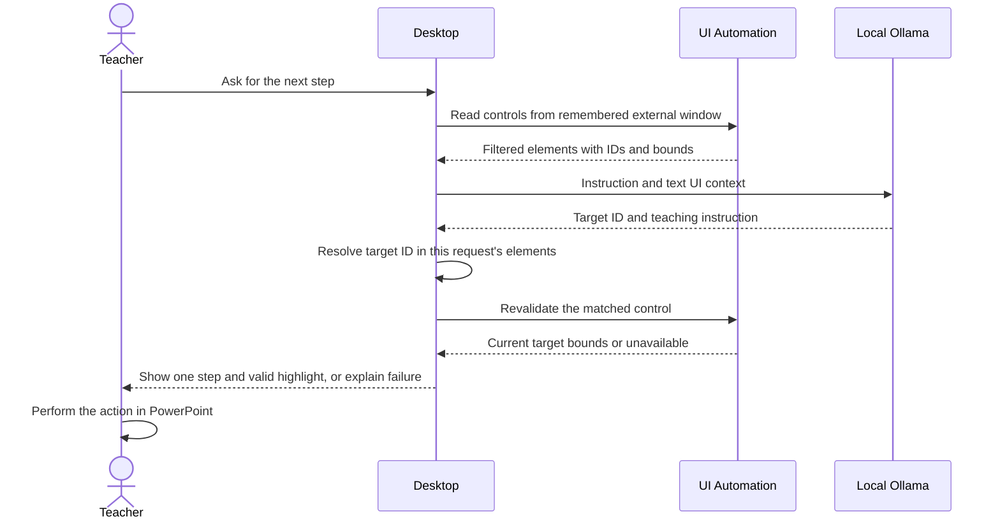

# Implementation notes

Product boundaries and acceptance criteria live in [product scope](PRODUCT_SCOPE.md) and [PRD](PRD.md). See [data model/ERD](DATA_MODEL.md) for the runtime objects and [validation plan](VALIDATION_PLAN.md) for planned evidence. These docs do not change the code or add persistence.

## Components and dependencies

| Project | Responsibility | References |
|---|---|---|
| `LocalTutor.Desktop` | WPF command palette, native shortcut, foreground context, mock tutor, Ollama boundary | Core |
| `LocalTutor.Core` | Serializable tutoring models and shared contracts | No application projects |
| `LocalTutor.Tools` | Typed utility base class, approved-file inspection/image conversion, PNG compression, video inspection/download, bounded ZIP creation/extraction | Core |
| `LocalTutor.Tests` | Focused tests for shared contracts and pure tool logic | Core, Tools |

Desktop targets `net10.0-windows`; Core, Tools, and Tests target `net10.0` because their shared logic does not require Windows. Add a Desktop → Tools reference only when the desktop needs a real utility. No database, web server, or additional framework is required.

## Current execution flow

1. Application startup captures the original foreground window handle before showing the assistant. WPF then creates the assistant and registers a native hotkey after its own window handle exists.
2. On each `Ctrl + Space`, the handler again captures the foreground window handle **before** showing and activating the assistant. It keeps the last external window if the assistant itself is foreground. A handle (`HWND`) identifies a native Windows window; future UI Automation must inspect that original window.
3. Input submission constructs a `TutorRequest` and calls `ILocalTutorService` asynchronously. The bootstrap implementation is visibly a mock and supplies no real captured UI elements.
4. The response is rendered in the assistant. No model, highlighting, or computer action occurs.
5. Escape hides only when the hotkey is registered. Closing exits; native registration and the message hook are cleaned up. If registration fails, the window remains reachable and reports the collision.

Ollama availability is a separate asynchronous status check. Failure must leave the mock assistant usable. Cancellation tokens let an operation stop when its caller no longer needs it; the UI thread must not block waiting for HTTP work.

### C# and WPF concepts used here

- A `record` holds a named data shape and provides value equality. These DTOs (data transfer objects) can be serialized to JSON without depending on WPF.
- An `interface` specifies what a service must provide. `App` supplies the mock implementation to the window's constructor; this is dependency injection without a container library.
- `Task<T>` represents an operation that produces a `T`. `await` lets the UI process input while an asynchronous operation waits. `string?` permits a missing string, such as no target ID.
- `TInput` and `TOutput` are generic type parameters: each tool chooses concrete input/output types. The interface's `in TInput` allows a tool accepting a broader input type to serve callers supplying a narrower subtype.
- XAML declares the controls; `x:Name` lets C# access a control. `IsDefault="True"` routes Enter to the submit button.
- `nint` holds a native-sized window handle. `DllImport` calls Windows functions from C#. `HwndSource.AddHook` receives `WM_HOTKEY` messages, and `Dispose` unregisters the shortcut when the window exits.

## Tutoring public API

Namespace: **`LocalTutor.Core`**.

| Contract | Members and meaning |
|---|---|
| `ScreenRectangle` | `Left`, `Top`, `Width`, `Height`, in physical screen pixels; negative left/top are valid on multi-monitor desktops |
| `UiElementSnapshot` | `Id`, `Name`, `ControlType`, `Bounds`, optional `IsEnabled`; IDs are stable within one snapshot, not across application changes |
| `TutorRequest` | `Instruction`, `ActiveApplicationName`, `Elements` |
| `TutorResponse` | Nullable `TargetElementId`, `Instruction`, `Success`, optional `Error` |
| `ILocalTutorService` | `Task<TutorResponse> GetNextStepAsync(TutorRequest request, CancellationToken cancellationToken = default)` |

A future response target must resolve to an element from the same captured snapshot before any highlight appears. The future highlight layer must convert physical pixels to WPF device-independent units using the appropriate monitor DPI. Never treat model-generated coordinates as validated screen geometry.

## Member 2: tool public API

Contracts are in **`LocalTutor.Core.Tools`**:

```csharp
public abstract record ToolInput
{
    public abstract IReadOnlyList<string> Validate();
}

public sealed record ToolResult<TOutput>(bool Success, TOutput? Value, string? Error = null);

public interface ILocalTool<in TInput, TOutput> where TInput : ToolInput
{
    string Id { get; }
    string Description { get; }
    Task<ToolResult<TOutput>> ExecuteAsync(TInput input, CancellationToken cancellationToken = default);
}
```

Implementation base: **`LocalTutor.Tools.LocalTool<TInput, TOutput>`**, constrained to `TInput : ToolInput`. Derive from it, define `Id` and `Description`, and implement `ExecuteValidatedAsync(TInput input, CancellationToken cancellationToken)`. Its public `ExecuteAsync` checks cancellation and validation before reaching your implementation. Validation returns all input errors; a nonempty list prevents execution.

Use a small typed input record and output record for each approved utility. Test invalid input, success, and cancellation in a tool-specific test file. A future caller must explicitly allow approved tool IDs and obtain appropriate confirmation before execution; the generic contract alone is not an authorization system. Do not add a string-based shell-command tool or a plugin discovery framework.

## File inspection and image conversion

Selected slice completed locally on `tool_calling_functions`: **`file.inspect` and `file.convert_image`**. The IDs match the planning directory's `TOOL_FUNCTIONS_INDEX.txt`. Both classes derive from the existing `LocalTool<TInput, TOutput>`; Core, Desktop, and project configuration are not part of this change. No registry exists and neither tool is callable through the assistant UI/model yet. The lead must wire an allowlist and effect-specific consent before any future integration; H guidance remains without tool execution.

### Typed arguments and results

Namespace: `LocalTutor.Tools.FileInspectionAndConversion`. Unknown JSON properties and missing required arguments are rejected. Validation checks undefined enum values, paths, dimensions, output extension, transparency, and quality before execution. `ToolResult<T>` returns success/value or a generic reason in `Error`, without native diagnostics or private input paths. Cancellation follows the existing contract by throwing `OperationCanceledException`; it is not reported as success.

| ID / class | Arguments | Result |
|---|---|---|
| `file.inspect` / `InspectFileTool` | `InspectFileInput`: required `InputPath` | `InspectedFile`: `DetectedType`, `Extension`, `SizeBytes`, nullable `Width`, `Height`, `PageCount`, `DurationSeconds`, `Verification` (`Decoded` or `SignatureOnly`), `SupportedNextActions`, `Warnings`. No input path/name, text, EXIF values, previews, or embedded content. |
| `file.convert_image` / `ConvertImageTool` | `ConvertImageInput`: required `InputPath`, `OutputPath`, `Format` (`Png`, `Jpeg`, `WebP`); optional `Transparency` (`Preserve` default or `FlattenWhite`), paired `MaxWidth`/`MaxHeight` (1–8192), `Quality` (1–100 for JPEG/WebP, default 85; not accepted for PNG) | `ConvertedImage`: actual `OutputPath`, `Format`, `SizeBytes`, `Width`, `Height`, `HasAlphaChannel`, `ColorHandling`, `Warnings`. Metadata and readability checked by decoding the actual encoded output. |

`FileAccessScope` and `ImageMagickCodec` are **trusted caller configuration**, separate from serializable model arguments. Construct a fresh scope after the user selects an existing workspace and approves the exact input and new output paths. Merely accepting a path in model output grants no permission. Never deserialize these configuration objects from model output. The caller owns approval freshness and cancellation, and must show the requested effect before dispatch.

`file.inspect` reads at most 32 signature bytes for other regular files. PDF, ZIP (Office subtype unverified), WAV, ISO base media, EBML, and ID3-tagged containers receive explicitly unverified signature labels; arbitrary files receive `Unknown`. Page count and duration remain null. Images with configured codecs are fully decoded for dimensions, bounded by the limits below. Extension/content mismatch, corrupt data, oversized images, and animation are rejected. Only decodable supported color spaces without ICC profiles offer `file.convert_image` as a next action. Without a configured codec, image inspection returns signature metadata with a warning and no available conversion action.

### Supported image matrix and bounds

| Source → output | PNG | JPEG | WebP |
|---|---|---|---|
| PNG | Tested | Tested | Tested |
| JPEG (`.jpg`/`.jpeg`) | Tested | Tested | Tested |
| WebP | Tested | Tested | Tested |

Only single still images are supported. APNG/WebP animation chunks and decoded multiple frames are rejected. Input limit: 20 MiB; output limit: 32 MiB; dimensions: at most 8192 on each side and 4 million decoded pixels. Resize fits the requested box, retains aspect ratio, and never enlarges. Native calls have a 15-second deadline each (up to three calls per conversion), one thread, a 128 MiB pixel-cache budget, and disabled mapped/disk pixel caches. Native process/runtime overhead is additional; these limits are not a hard OS memory quota. Standard output is bounded and native error text is discarded.

JPEG requires explicit `FlattenWhite` even for an opaque source. PNG/WebP can preserve alpha or flatten onto white. WebP alpha uses quality 100 independently of its lossy RGB quality. EXIF orientation is applied; conversion outputs 8-bit sRGB and removes metadata. RGB/sRGB/gray inputs are accepted; embedded ICC profiles and CMYK/other color spaces are rejected for conversion. This is not a color-managed print workflow. No fidelity, byte-for-byte pixel identity, visual-quality, or file-size-reduction guarantee is made. JPEG/WebP encoding and resizing can lose detail. Review the result.

Approvals are restricted to exact paths inside the selected workspace. Traversal, ambiguous paths, network/device/alternate-stream paths, filesystem-root workspaces, protected system locations, symbolic links, and reparse points are rejected. Output directories must exist; no source replacement, existing-file overwrite, batch conversion, or directory creation is exposed. Paths are rechecked before saving/publishing; a temporary sibling file is renamed with overwrite disabled after successful encoding/readability verification. Partial outputs are removed on failure/cancellation. The rename is the commit point: cancellation after it cannot undo the saved image.

The native worker receives only fixed arguments and image bytes, never a user filename or arbitrary command string. ImageMagick may spool stdin; each call uses an isolated OS temporary directory, deleted after worker exit including cancellation/timeout. Unix scratch permissions are owner-only; Windows uses the user's temporary-directory ACL. `CleanupFailed` reports inability to remove native scratch. This is ordinary cleanup, not secure erasure or crash recovery. No telemetry or file-content logging is added.

These managed path checks are not a race-free OS sandbox. Use ordinary local files in a workspace whose directories cannot be concurrently replaced by an untrusted process. Approval expiry/revocation, hostile directory races, special Unix files/network mounts, Windows junctions and ACLs, and crash recovery require integration/device hardening before wider exposure.

### Local dependency setup and teacher handoff

ImageMagick is the only directly invoked dependency. Tests used installed **6.9.12-98 Q16 x64** with libpng 1.6.43, libjpeg-turbo 2.1.5, libwebp 1.3.2 and zlib 1.3. Installed package copyright/license records were inspected locally; no download or cloud conversion was used. The separate planning inventory `Tool_Calling_Prompts/OPEN_SOURCE_TOOLS_USED.txt` records versions, official URLs, licenses, packaging and attribution obligations for the selected native dependency and codec delegates. No NuGet dependency was added. No native binary is bundled; a Windows binary/codec/policy/security-maintenance choice and its bundled licenses remain to be verified on the actual device. ImageMagick 7's `magick.exe` path is accepted as host configuration, but only the stated version 6 build has been tested.

Configure the absolute installed `magick.exe` (or ImageMagick 6 `convert.exe`) path in the trusted caller; do not rely on PATH or Windows' unrelated `convert.exe`. Missing/unstartable dependencies return `MissingDependency`, unavailable codecs/policy/corrupt data return `CodecFailed`, and deadlines return `TimedOut`. No installation or dependency download is automatic. Header-only `InspectFileTool` can be used without ImageMagick.

Example after the teacher has approved one water-cycle illustration and the exact new name:

```csharp
string workspace = @"C:\Classroom\LessonAssets";
var scope = new FileAccessScope(workspace,
    approvedInputs: ["water-cycle.webp"],
    approvedOutputs: ["water-cycle-slides.png"]);
var codec = new ImageMagickCodec(trustedInstalledImageMagickPath);
var inspected = await new InspectFileTool(scope, codec)
    .ExecuteAsync(new InspectFileInput("water-cycle.webp"), cancellationToken);
// Present the requested new file/format to the user and confirm before dispatch.
var converted = await new ConvertImageTool(scope, codec, progress)
    .ExecuteAsync(new ConvertImageInput("water-cycle.webp", "water-cycle-slides.png",
        ImageFormat.Png, TransparencyMode.Preserve, MaxWidth: 1600, MaxHeight: 900), cancellationToken);
```

Check `Success` and use the returned output path. The teacher reviews the new PNG and inserts it manually through the presentation app's file picker. This demonstrates file preparation only; PowerPoint insertion/acceptance and the main tutoring flow are not verified by these tests.

### Planned functions: no executable implementation or advertised availability

| Exact ID | Proposed bounded argument/result shape for coordination | Remaining work |
|---|---|---|
| `file.convert_document` | Required approved `InputPath`, new approved `OutputPath` ending `.pdf`; input content/extension allowlist DOCX/PPTX/XLSX. No converter options from the model. Result: actual PDF path, byte size, verified page count and fidelity/font/layout warnings. | Installed LibreOffice remains a candidate, not an adopted dependency. Requires isolated local conversion, missing-dependency/font handling, process/output/resource limits, real PDF readability and Office fixture checks. No PDF-to-editable-Office conversion promise. |
| `file.convert_media` | Required approved `InputPath`, new approved `OutputPath`, target enum (`Mp4`, `WebM`, `Mp3`, `Wav`), preset enum (`Small`, `Balanced`, `HighQuality`); caller cancellation and progress. Result: actual path, format, size, verified duration/streams and warnings. No raw FFmpeg flags. | FFmpeg remains a candidate, not an adopted dependency. Video MP4/WebM and audio MP3/WAV matrices/presets are proposals, untested and unavailable; require explicit codec/build licenses, stream selection, metadata sanitization, fixed flags, limits and real decoded output checks. |

### Verification and changed C# files

Linux Mint 22.3, .NET SDK 10.0.112: all **24 focused utility cases / 27 repository tests** pass with real local codecs. The Tools project build with `--no-restore -warnaserror` passes with zero warnings/errors; `git diff --check` passes. Coverage includes the nine source/output pairs with raw RGBA readability, dimensions/resize, alpha preservation and JPEG white compositing, metadata removal/privacy, malformed/truncated/mismatched/animated/oversized files, ICC-marker/CMYK rejection, missing dependencies, strict JSON/arguments, approvals/traversal, existing/source/late output conflicts, symlinks introduced before saving, cancellation, native timeout/process exit and scratch cleanup. The deliberately incomplete ICC fixture tests rejection; it does not verify profile fidelity. POSIX worker/symlink fixtures do not execute on Windows; tests on Windows require the native dependency and separate junction/process-tree checks. No WPF smoke check, actual presentation-tool acceptance, native Windows run or model integration was performed in this slice.

```powershell
# Windows test configuration (must point to an already installed trusted binary):
$env:LOCAL_TUTOR_IMAGEMAGICK = 'C:\path\to\ImageMagick\magick.exe'
dotnet test tests/LocalTutor.Tests/LocalTutor.Tests.csproj --no-restore --filter FullyQualifiedName~FileInspectionAndConversion
dotnet test tests/LocalTutor.Tests/LocalTutor.Tests.csproj --no-restore
dotnet build src/LocalTutor.Tools/LocalTutor.Tools.csproj --no-restore -warnaserror
```

Tests use synthetic fixtures and temporary directories, with no external transfer. Existing package restore assets were used offline. New source files (all under `src/LocalTutor.Tools/FileInspectionAndConversion/`): `FileToolContracts.cs`, `FileAccessScope.cs`, `ImageContent.cs`, `ImageMagickCodec.cs`, `InspectFileTool.cs`, `ConvertImageTool.cs`. New focused test file: `tests/LocalTutor.Tests/FileInspectionAndConversion/ImageToolTests.cs`. Documentation updates: this file and the existing root README. The unrelated pre-existing Desktop project edit is excluded. Before commit, the handoff and inventory must be current and both author/committer must be the user-confirmed identity; this prompt permits no push or publication.

## Video inspection and download

Completed local library slice on `tool_calling_functions`: **`video.inspect_url` / `InspectVideoTool`** and **`video.download` / `DownloadVideoTool`**, with the exact IDs from `TOOL_FUNCTIONS_INDEX.txt`. Both reuse `LocalTool<TInput,TOutput>` and its `ILocalTool` contract. New implementation files are confined to `src/LocalTutor.Tools/VideoDownload/`; focused tests are in `tests/LocalTutor.Tests/VideoDownload/`. Core, Desktop and project configuration were not changed. These online tools have no cloud AI dependency and are not available through the desktop or a model registry.

### Arguments, results and host consent

Namespace: `LocalTutor.Tools.VideoDownload`. Required JSON arguments and unknown-property rejection follow the existing file-tool conventions. Errors are generic codes/messages in `ToolResult.Error`; native diagnostics, cookies and media URLs are never returned. Cancellation throws `OperationCanceledException`.

| ID | Typed arguments | Result |
|---|---|---|
| `video.inspect_url` | `InspectVideoInput(Url)` | `InspectedVideo`: title, nullable duration seconds, source service, relevant `VideoFormatChoice` entries and warnings. Each choice has quality, container, actual height, nullable estimated bytes and `RequiresFfmpeg`. No raw metadata, cookies, history or CDN URLs. |
| `video.download` | `DownloadVideoInput(Url, DestinationPath, Quality)` | `DownloadedVideo`: actual local path, container, bytes and status (`Completed`, or `CompletedWithCleanupWarning` if the saved media exists but its empty staging directory could not be removed). Failures publish no new file; a cancellation after the final rename cannot undo that saved file. |

Allowlisted qualities are `Mp4_360p`, `Mp4_720p`, and `WebM_720p`. They mean a maximum height, not a promise that the source offers exactly that resolution. The selected format is deterministic by height, size and validated native format identifier. Combined HTTPS audio/video is accepted directly. With configured, pinned FFmpeg, separate MP4 + M4A or WebM + WebM HTTPS streams can be merged into one file without re-encoding. HLS, DASH fragment transports, audio-only outputs, conversion and upscaling are disabled. Estimates may be unavailable and do not guarantee the final size.

`YtDlpClient`, the selected workspace, the exact inspection URL approval, and `VideoDownloadApproval` are **trusted host configuration**, never model arguments. A caller must obtain the user's URL and rights confirmation; public access does not establish permission to download. The preview helper performs metadata inspection only and does not authorize a download:

```csharp
var client = new YtDlpClient(trustedYtDlpPath, trustedFfmpegPath); // Optional second path.
var inspection = await new InspectVideoTool(client, userSelectedUrl)
    .ExecuteAsync(new InspectVideoInput(userSelectedUrl), cancellationToken);
var input = new DownloadVideoInput(userSelectedUrl, userSelectedNewPath, userSelectedQuality);
var preview = await DownloadVideoTool.PreviewAsync(client, input, userSelectedWorkspace, cancellationToken);
// Check Success. Display the selected URL, preview.Value.Source, Title, DurationSeconds,
// Filename, Format (including estimated bytes), and DestinationPath; obtain explicit approval and rights confirmation.
// Only after that confirmation, construct trusted consent and dispatch once:
var consent = new VideoDownloadApproval(preview.Value!);
var downloaded = await new DownloadVideoTool(client, consent, progress)
    .ExecuteAsync(input, cancellationToken);
```

Approval expires after five minutes and is consumed by one attempt, including a failed attempt. A changed URL, quality, destination, metadata, or selected format requires a new preview and confirmation. The destination must be a new absolute local filename within the user's selected existing workspace. The existing `FileAccessScope` is reused without modification for exact output approval, traversal/protected-path/reparse-point checks and conflict prevention. ASCII MP4/WebM filenames exclude native template metacharacters and reserved device names. The native worker receives a fixed staging filename; the user filename never enters native arguments. No overwrites or output-directory creation are exposed.

### Local dependencies and limits

Configure an absolute trusted `yt-dlp` / `yt-dlp.exe` path. The only admitted yt-dlp version is **2026.08.19**; the old system `2024.04.09` is rejected. Optional FFmpeg must be named `ffmpeg` / `ffmpeg.exe`, supplied by absolute trusted path, and report **9.0.1**. Missing yt-dlp is an execution error. Missing/unconfigured FFmpeg is reported as a warning and suppresses choices requiring a merge; a configured version mismatch is rejected before source access. No binary download/update occurs inside a function, and ambient FFmpeg lookup on PATH is disabled. Upstream yt-dlp may discover an ffprobe companion beside the explicitly configured FFmpeg; trust that directory as part of the same verified distribution. Version strings are checked on each inspection/reinspection; the installer/host must verify provenance/checksums and protect native files from replacement.

For this session, the user specifically approved obtaining the official release and two sample URLs. The Linux zipimport `yt-dlp` release was stored outside the repository in local native-tool storage; its SHA-256 matched the release's `SHA2-256SUMS`: `1fa6733c37ea6fb51c99ad8fe785e7b7e5f3246c9b980230329d4fb72ed8d4d6`. This checksum is for that Linux asset, not Windows `yt-dlp.exe`; no GPG-signature verification is claimed. The tested interpreter was preinstalled Python 3.14.7. FFmpeg 9.0.1 was already installed. All C# logic uses built-in .NET APIs; no NuGet dependency was added. Dependencies and runtime/license details are recorded in the planning directory's existing `OPEN_SOURCE_TOOLS_USED.txt`, outside this repository's commit.

Native invocation uses `UseShellExecute=false`, `ProcessStartInfo.ArgumentList`, a fixed executable and fixed switches, with only the validated selected URL and bounded native format IDs added. yt-dlp configuration, plugins, remote components, JS runtimes, browser cookies, cookie files, cache, proxies, netrc opt-in, geo bypass and command hooks are disabled/omitted. No authentication, paywall/DRM bypass, search, playlist or bulk interface exists. Live/upcoming, DRM, age-restricted and non-public metadata is rejected. Source terms and rights remain the user's responsibility.

Accepted input shapes are HTTPS YouTube `/watch?v=<11-character-ID>`, `youtu.be/<ID>`, numeric public Vimeo video URLs, and direct MP4/WebM paths under `upload.wikimedia.org/wikipedia/commons/`. YouTube extra query parameters and playlist URLs are rejected. The source and selected video/audio CDN DNS answers must all be public addresses. Selected CDN hosts are restricted to Googlevideo, Vimeo CDN/Akamai, or Wikimedia according to the source. Extractors are restricted per source. These checks are **not an OS network sandbox**: yt-dlp performs its own later DNS resolution and API/redirect requests, so rebinding and every downstream request are not comprehensively blocked. Expand source coverage only with coordinated egress enforcement and additional tests.

Limits: one download, at most **600 seconds** and **100 MiB** final output; total staging files are also sampled against 100 MiB every 100 ms, with a native 4 MiB/s rate setting. Merging temporarily retains streams plus output and may hit the staging cap even if the final file would fit. The sampled staging cap is not a hard filesystem quota and can transiently overshoot; no output above 100 MiB is published. DNS checks have five-second deadlines, native version checks five seconds each, metadata calls thirty seconds, and one download/merge three minutes. A preview and execution each reinspect; total workflow time includes those calls. Native output is limited to 2 MiB for metadata and smaller budgets for version/completion output. stderr is drained and discarded, not logged.

Partial files use a private staging directory next to the approved destination, removed on failure/cancellation. The completed file's size and MP4 `ftyp` / WebM EBML signature are checked before a rename with overwrite disabled. This is container-signature verification, not complete media decoding or a playback/codec compatibility guarantee. Unknown duration disables downloading while metadata inspection still succeeds; videos over the duration limit can also be inspected with a download-limit warning. Progress reports stage, bytes and estimated bytes, without URLs or paths. Native runtime memory has no hard OS quota. Ordinary-user path checks do not defeat a concurrent attacker swapping filesystem components; isolated host permissions remain necessary.

### Verification and manual handoff

On Linux with .NET SDK **10.0.112**, **87 focused offline cases** passed, including stub metadata/process output, consent mismatch/expiry/replay, URL and DNS rejection, native output limits, cancellation, malformed metadata, DRM/access restrictions, dependency/version failures, combined/WebM/merge outputs, output conflicts, boundary/symlink checks and partial cleanup. The optional installed-binary test also verified the fixed yt-dlp switches through its actual parser without network. **All 114 repository offline cases passed**, with the one live test skipped. Tools built with `-warnaserror`: zero warnings/errors. Existing restore assets were reused with `--no-restore`.

The separately approved live check passed for a **205-second user-selected YouTube video**, including inspection, preview, fresh consent, MP4 download/FFmpeg merge, actual byte count/path verification and cleanup. The earlier approved sample exceeded the ten-minute cap and was not downloaded. The URLs and video titles are deliberately absent from repository documentation. This proves one Linux source/format case; Vimeo, Wikimedia, live WebM and Windows native/FFmpeg execution have not been verified. No desktop/model integration or playback acceptance is claimed.

```powershell
# Offline; LOCAL_TUTOR_YTDLP optionally enables the native option-parser check only.
dotnet test tests/LocalTutor.Tests/LocalTutor.Tests.csproj --no-restore --filter FullyQualifiedName~VideoDownload
dotnet test tests/LocalTutor.Tests/LocalTutor.Tests.csproj --no-restore
dotnet build src/LocalTutor.Tools/LocalTutor.Tools.csproj --no-restore -warnaserror
```

Manual lawful-sample check, **only after specific user approval of this test and URL**: choose a publicly accessible video the user has rights to download, under ten minutes, with an offered MP4/WebM format. Configure trusted, verified binaries; display/approve the preview; cancel an attempt and check for partials; retry only with fresh consent. Check the returned path, byte count, container and local playback on the intended demo device. For the automated temporary sample check, set `LOCAL_TUTOR_YTDLP`, optional `LOCAL_TUTOR_FFMPEG`, `LOCAL_TUTOR_APPROVED_VIDEO_URL`, and `LOCAL_TUTOR_APPROVED_LIVE_VIDEO_TEST=1`, then run `dotnet test tests/LocalTutor.Tests/LocalTutor.Tests.csproj --no-restore --filter FullyQualifiedName~ApprovedLiveVideoTests`. It creates/removes a temporary directory inside the video test directory. Unset the approval variables afterward. These variables belong to the test harness, not application settings or an authorization mechanism.

Lead handoff: allowlist the exact IDs, supply trusted native paths and host-owned user approval, display the preview and source URL before dispatch, propagate cancellation/progress, handle failures/cleanup warnings, and qualify the installed Windows binaries and playback before advertising the tools in the UI. No Core contract change is needed for this library slice. The user-confirmed author/committer is `KampferArchives <eleneusgyen@gmail.com>`; `gh auth status` confirmed that GitHub account is active. Commit only this prompt's source/tests and existing documentation; exclude the pre-existing Desktop project edit, native binaries, temporary media and the separate planning inventory. No push/publication is authorized.

Dependency references: [yt-dlp release](https://github.com/yt-dlp/yt-dlp/releases/tag/2026.08.19), [yt-dlp licensing and installation](https://github.com/yt-dlp/yt-dlp#licensing), [bundled dependency notices](https://github.com/yt-dlp/yt-dlp/blob/2026.08.19/THIRD_PARTY_LICENSES.txt), [FFmpeg legal/build conditions](https://ffmpeg.org/legal.html). Upstream yt-dlp source is Unlicense; official PyInstaller executable distributions contain GPLv3+ code. FFmpeg's license depends on its build; the tested build enables GPL and version 3. No native redistribution is included here.

## PNG compression

Selected demo slice: **`file.compress_image` / `CompressImageTool`**, **PNG to PNG only**. The exact ID matches `Tool_Calling_Prompts/TOOL_FUNCTIONS_INDEX.txt`. It derives from `LocalTool<CompressImageInput, CompressedImage>` and reuses the existing `FileAccessScope`, `ImageContent` and `ImageMagickCodec` without changing those files, Core, Desktop or project configuration. The classroom illustration workflow is the basis for choosing this narrow slice. No desktop/model registry or end-to-end teaching integration is claimed.

### Arguments, preview, approval and result

Namespace: `LocalTutor.Tools.Compression`. Required model arguments are `InputPath`, `OutputPath` (PNG filenames) and `Preset` (`Slides1600` or `Share800`). Unknown JSON members, missing arguments, numeric/unknown presets, traversal and invalid paths are rejected. There are no model-provided quality values, resize dimensions, executable names, codecs, native switches or approval flags. The JSON Schema definitions `Arguments` and `Result` are in [`compress_image.schemas.json`](../src/LocalTutor.Tools/Compression/compress_image.schemas.json); use the default C# property names when integrating them. Schema validation supplements the C# content, path and permission checks.

| Preset | Fixed behavior |
|---|---|
| `Slides1600` | PNG, preserve transparency, fit within 1600 × 900, preserve aspect ratio, never enlarge |
| `Share800` | PNG, preserve transparency, fit within 800 × 600, preserve aspect ratio, never enlarge |

Both use the existing encoder's 8-bit sRGB conversion, orientation handling and metadata removal. PNG accepts no lossy quality number. Resizing and bit-depth/color changes can remove detail; embedded ICC profiles and non-RGB/gray input are rejected. A PNG output does **not** establish lossless optimization. The preview warns about small text/detail and the teacher must review the saved image before sharing.

`PreviewAsync` requires host-owned exact path approval and a trusted codec. It reads and decodes the PNG, generates a bounded candidate, decodes the candidate, and returns an `ImageCompressionPreview` containing canonical input/output paths, expiry and `ImageCompressionSummary`: `Preset`, `OriginalBytes`, `NewBytes`, `OriginalWidth`, `OriginalHeight`, `NewWidth`, `NewHeight`, `HasAlphaChannel`, `IsSmaller`, and `Warnings`. Candidate byte sizes are actual encoded sizes. No destination/sibling file is created during preview; the codec may spool input into its existing isolated temporary storage. Neither preview creation nor model arguments authorize saving.

After the user sees the paths, preset, dimensions, byte sizes and warnings and explicitly approves that effect, the trusted host constructs `ImageCompressionApproval` and dispatches `ExecuteAsync` with the same typed input. Approval is bound to the exact input record and source SHA-256, expires after five minutes, and is consumed once by the preview even if another approval wrapper is created. Source changes, expired/disposed/reused previews and mismatched inputs require a new preview. Pre-execution cancellation and validation errors follow the base contract before consent is consumed. Dispose abandoned previews; keep at most one active preview per workflow. Preview/approval objects are host state and must never be deserialized from model output.

The result is `ToolResult<CompressedImage>` with `OutputPath`, `Status` and `Summary`. `Compressed` means the previewed, decoded bytes were saved to the returned canonical new path and `NewBytes < OriginalBytes`. `NoReduction` is a successful comparison with a null output path, `IsSmaller=false`, an explanation, and **no file written**. Do not display it as a successful compression or sharing action. Failures return `Success=false`, null value and generic error codes such as `UnsupportedFormat`, `FormatMismatch`, `UnsupportedColor`, `MissingDependency`, `CodecFailed`, `ResourceLimit`, `TimedOut`, `SourceChanged`, approval errors and output/path errors. Private paths and native diagnostic text are not included in errors. User cancellation throws `OperationCanceledException`, matching the existing contract; map it to a visible canceled status.

### Limits, dependency setup and consent handoff

The existing codec limits apply: input at most **20 MiB**, candidate at most **32 MiB**, each input dimension at most **8192**, at most **4 million decoded pixels**; native calls have a **15-second deadline each**, one thread, 128 MiB pixel-cache limit and no mapped/disk pixel cache. A preview uses three native calls (up to 45 seconds plus file I/O/process cleanup). Native overhead and transient buffers are additional; these are not hard OS memory/disk quotas. One smaller candidate is retained in memory per live preview until consumption/disposal; byte references are cleared rather than securely erased. Saving rechecks the source digest and approved paths before publishing, writes a temporary sibling, and renames with overwrite disabled. Failure/cancellation removes that sibling; cleanup failure is reported as `CleanupFailed` or `CanceledWithCleanupWarning`. The rename is the commit point; cancellation after it cannot undo the completed copy. Progress reports bounded stage names/percentages with no paths or image content.

The original is never replaced. Existing-file overwrite, output-directory creation and batch operations are unavailable. Path protections reject unapproved exact paths, traversal, network/device/alternate-stream paths, protected roots, symlinks and reparse points. Checks use the existing ordinary-user filesystem boundary; they are not an OS sandbox or protection against a concurrently hostile directory replacement. Use a trusted local workspace. Windows junctions/ACLs, process-tree behavior, special Unix files/network mounts and crash recovery still require device/integration hardening.

Dependency: separately installed **ImageMagick 6.9.12-98 Q16 x64**, reused with **libpng 1.6.43** and native **zlib 1.3** for PNG decoding/encoding. Installed license records and package versions were inspected locally; the existing shared planning inventory was extended without duplicating entries. No package download, new NuGet package or native redistribution is included. Windows callers supply the absolute trusted `magick.exe`/ImageMagick `convert.exe` path to `ImageMagickCodec` (never Windows' unrelated conversion executable). ImageMagick 7 and Windows codecs/policy/binary maintenance/licensing remain unverified. Missing/unstartable codec returns a failure; other compression formats and dependencies are not simulated.

```csharp
// Host-side code after the user selects the workspace/input and proposed new name.
var scope = new FileAccessScope(workspace,
    approvedInputs: ["water-cycle-slides.png"],
    approvedOutputs: ["water-cycle-shared.png"]);
var codec = new ImageMagickCodec(trustedInstalledImageMagickPath);
var input = new CompressImageInput("water-cycle-slides.png", "water-cycle-shared.png",
    ImageCompressionPreset.Share800);
var prepared = await CompressImageTool.PreviewAsync(scope, codec, input, cancellationToken);
if (!prepared.Success) { /* Display prepared.Error and return control. */ return; }
using var preview = prepared.Value!;
// Display preview.InputPath, OutputPath, Summary and warnings, then await explicit user approval.
// Only after approval:
var saved = await new CompressImageTool(new ImageCompressionApproval(preview), progress)
    .ExecuteAsync(input, cancellationToken);
// Display saved.Error or the actual saved.Value.Status, OutputPath and Summary.
```

Lead handoff: allowlist `file.compress_image`, bind the supplied schemas, keep codec/scope/approval in trusted host state, display the preview, propagate progress/cancellation and dispose abandoned previews. The teacher reviews the new file and shares it manually. Qualify the actual Windows dependency, readability and classroom workflow before advertising availability in the assistant. No Core contract change is required for this library slice.

### Verification and planned compression functions

On Linux with .NET SDK **10.0.112**, **26 focused compression cases passed** with the installed real codec. Coverage includes both presets and raw RGBA output decoding, alpha, aspect ratio, no enlargement, actual bytes/source preservation, metadata stripping, already-small files, corruption/truncation/signature mismatch/animation/ICC profiles, resource limits, missing dependency, strict arguments, exact path approval/traversal, conflicts before and during save, symlinks, source changes, approval mismatch/expiry/reuse/disposal, preflight/encoding/save cancellation, native timeout/process exit and partial cleanup. **The full offline repository run passed 139 cases, with two video checks skipped** (the live sample and optional pinned-binary parser check were disabled/unconfigured). The compression test collection runs separately because an existing image test compares all codec scratch directories under the OS temp directory; concurrent codec tests would invalidate that check. POSIX worker/link fixtures require separate Windows checks. Tools built with `--no-restore -warnaserror`: zero warnings/errors. No network fixture, Windows/WPF run, model dispatch or PowerPoint acceptance was tested for this prompt.

```powershell
$env:LOCAL_TUTOR_IMAGEMAGICK = 'C:\path\to\installed\ImageMagick\magick.exe'
dotnet test tests/LocalTutor.Tests/LocalTutor.Tests.csproj --no-restore --filter FullyQualifiedName~Compression
dotnet test tests/LocalTutor.Tests/LocalTutor.Tests.csproj --no-restore
dotnet build src/LocalTutor.Tools/LocalTutor.Tools.csproj --no-restore -warnaserror
```

| Exact ID / format | Status and coordination requirement |
|---|---|
| `file.compress_image` — JPEG/WebP | Planned; not accepted by the PNG implementation. Requires selected allowlisted quality/resize presets, codec/metadata/alpha/fidelity tests and inventory updates before use. |
| `file.compress_media` | Planned; no executable class or advertised availability. Select one real audio/video demo format first; fixed FFmpeg presets, verified duration/media type/readability, unsupported-codec results, cancellation and resource limits need tests. Existing download stream-copy qualification does not verify encoding. |
| `pdf.optimize` | Planned; no executable class or adopted PDF optimizer. Select a free local utility/library and verify page count/readability, encryption/features/image-quality tradeoffs, cancellation/conflicts and size outcomes. No lossless claim without verification. |

Changed files are confined to new `src/LocalTutor.Tools/Compression/` and `tests/LocalTutor.Tests/Compression/` files and these existing shared docs/root README. The dependency inventory stays in the separate planning directory and is excluded from Git. Commit author and committer use the confirmed `KampferArchives <eleneusgyen@gmail.com>` identity. Commit only this completed prompt on local `tool_calling_functions`; the pre-existing Desktop project edit is excluded. No push, publication, deployment or external transfer is authorized.

## ZIP archives

Completed local library slice: **`archive.create_zip` / `CreateZipTool`** and **`archive.extract_zip` / `ExtractZipTool`**, in namespace `LocalTutor.Tools.ZipArchive`. IDs match the planning directory's `TOOL_FUNCTIONS_INDEX.txt`. Both derive from `LocalTool<TInput, TOutput>` and use the existing Core contracts. New implementation/test files are confined to `src/LocalTutor.Tools/ZipArchive/` and `tests/LocalTutor.Tests/ZipArchive/`. No Core, Desktop, project or solution change is included. No registry or Desktop/model dispatch exists for these tools; the lead must coordinate integration before advertising them in the assistant.

### Inputs, previews and results

| Tool | Typed model input | Successful result |
|---|---|---|
| `archive.create_zip` | `CreateZipInput(InputPaths: string[], OutputPath: string, ExcludedPaths: string[]? = null)` | `CreatedZip(ArchivePath, ArchiveBytes, EntryCount, InputBytes)` |
| `archive.extract_zip` | `ExtractZipInput(ArchivePath: string, OutputDirectory: string)` | `ExtractedZip(OutputDirectory, ExtractedPaths, FileCount, DirectoryCount, ExpandedBytes)` |

Required JSON fields are annotated; unknown members are rejected. Arguments carry no consent. `InputPaths` selects exact ordinary files/directories; a selected directory includes its ordinary descendants. ZIP names retain each selection's basename and relative subtree, including empty directories. Overlapping selections and colliding basenames are rejected. Optional exact exclusions must be descendants of a selected directory and exclude their subtrees. If the proposed ZIP lies inside a selected subtree, its exact output path is automatically excluded and shown in the preview. Excluded content is never opened. Originals are never changed. Creation uses **stored ZIP entries (`NoCompression`)** so it cannot produce an archive that violates the extraction expansion-ratio limit; packaging is not a compression/size-reduction promise. Timestamps, permissions and extended filesystem metadata are not preserved in entries.

Trusted host code constructs `ArchiveAccessScope(workspacePath, approvedInputs, approvedOutputs)` after the user selects an existing local workspace and exact inputs/output. Approving an input directory authorizes reading its descendants; it does not approve other workspace paths. The output's parent must exist, while the output file or extraction directory must be new. Extraction into an existing directory, even an empty one, is a conflict; no merge or overwrite mode is exposed.

Each tool's static `PreviewAsync(scope, input, cancellationToken, progress, clock)` returns `ToolResult<ArchivePreview>` without creating any output. Display **`OutputPath`, `Entries` (`Name`, `IsDirectory`, `Bytes`), `EntryCount`, `TotalInputBytes`, `Exclusions`, `Conflicts`, and `ExpiresAt`**. Extraction entries include implied directories, so the proposed tree is complete; `Bytes` are declared expanded sizes until actual extraction verifies them. Creation sizes are counted while hashing actual inputs. Existing ordinary outputs are listed as conflicts; unsafe names/trees and denied paths fail preview. A preview containing any conflict cannot execute. The output field and every entry name describe the proposed output tree, not a completed operation.

Only after the user explicitly approves that displayed effect may the host construct `ArchiveApproval(preview)` and pass it to the matching tool constructor. Preview/approval/scope are host state, never model-deserialized objects. Approval is bound to the exact typed input snapshot, source hashes and tree, expires after five minutes, and is consumed once per preview, including failed execution attempts. New approval wrappers do not reset consumption. Dispose abandoned previews and keep one active preview per workflow. Validation/pre-cancellation follows the base contract before consuming approval. Source changes, additions/removals, mismatch, expiry or reuse require a fresh preview and user decision. The optional `TimeProvider` is trusted host configuration for approval expiry, not a model argument.

```csharp
var scope = new ArchiveAccessScope(workspace,
    approvedInputs: ["lesson-materials"], approvedOutputs: ["lesson-materials.zip"]);
var input = new CreateZipInput(["lesson-materials"], "lesson-materials.zip");
var prepared = await CreateZipTool.PreviewAsync(scope, input, cancellationToken);
if (!prepared.Success) { /* Display prepared.Error and return control. */ return; }
using var preview = prepared.Value!;
// Display every preview field above; obtain explicit user approval of this exact effect.
var result = await new CreateZipTool(new ArchiveApproval(preview), progress)
    .ExecuteAsync(input, cancellationToken);
// Display result.Error or the actual result.Value.ArchivePath/ArchiveBytes.

// Extraction is a separate user invocation, selection, preview and approval.
var extractScope = new ArchiveAccessScope(workspace,
    approvedInputs: ["lesson-materials.zip"], approvedOutputs: ["lesson-unpacked"]);
var extractInput = new ExtractZipInput("lesson-materials.zip", "lesson-unpacked");
var inspected = await ExtractZipTool.PreviewAsync(extractScope, extractInput, cancellationToken);
// Check inspected.Success, display its preview and obtain fresh explicit approval.
// Then: new ExtractZipTool(new ArchiveApproval(inspected.Value!), progress).ExecuteAsync(...)
// Dispose the extraction preview when finished or abandoned.
```

### Validation, resource limits and failure handling

The format allowlist is **ordinary single-disk ZIP with stored or deflated entries only**. Content/signatures, the end record and central-directory structure are checked independently of the `.zip` extension. ZIP64, encrypted archives, self-extracting/prefixed archives, multidisk archives and other archive formats/methods are rejected. Preview checks the central-directory count/size before constructing .NET entry objects. ZIP entry permissions/attributes are not applied. Symlinks, reparse-point/device metadata and Unix special-file types are rejected; directory names/types must agree and directory data must be empty. Extraction verifies actual expanded byte counts and an independently computed CRC32 for each file before publication, rather than trusting metadata or .NET decompression alone.

Canonical path and ancestor checks reject unapproved/out-of-workspace paths, protected system locations, drive-relative/network/device paths (including Windows drives identified as network drives), alternate streams, traversal, symlinks/reparse points and invalid Windows components. Entry rules apply on every OS: forward-slash relative names, depth at most 32, components at most 255 UTF-16 characters, entry names at most 1024 characters, extraction paths at most 1024 characters, no empty/dot components, trailing dots/spaces, controls, drive letters/streams, reserved device aliases (including superscript COM/LPT forms), or `~` short-name aliases. Names must use Unicode NFC. Duplicate names, case collisions anywhere in the tree, and file/directory collisions are rejected with ordinal case-insensitive comparisons. Archive names encoded in more than 1024 bytes are rejected during central-directory inspection. This is a conservative compatibility slice; some otherwise legitimate ZIPs/names are refused.

Fixed limits in `ArchiveLimits`: **4096 entries/tree nodes including implied directories**, **128 MiB per ordinary file**, **256 MiB total input/expanded bytes**, **256 MiB ZIP bytes**, **4 MiB central-directory metadata**, and **200:1 maximum expansion ratio for individual entries larger than 1 MiB**. Limits apply to declared sizes in preview and actual bytes while streaming. ZIP overhead counts against the archive-size cap, so a stored archive may reject an input near the total-byte ceiling. Each preview/execution has a **cooperative two-minute deadline**. I/O and enumeration run on a background task with cancellation between steps/chunks. These are application limits, not hard OS quotas: filesystem calls and trusted progress callbacks can delay cancellation, and no wall-clock timeout exhaustion or hostile OS stall was exercised in tests.

Execution rechecks the preview plan and sources, writes an isolated temporary sibling, rechecks paths/sources immediately before publication, and renames with overwrite disabled. Extraction publishes the complete staged directory; creation publishes the ZIP file. The rename is the commit point; cancellation arriving after it cannot undo the completed output. No progress callback runs after publication. Before that point, failure/cancellation removes the staging file/tree. Cleanup failure is reported as `CleanupFailed` or `CanceledWithCleanupWarning`; crash/power-loss recovery is not implemented. Progress uses only `ArchiveProgress(Stage, CompletedEntries, TotalEntries, ProcessedBytes)`, without paths or file content. Private paths are returned only in user-facing preview/results, not errors or telemetry; these tools write no logs and make no network/process calls.

Results follow `ToolResult<T>`: failures have `Success=false`, null value and codes including `InvalidZip`, `UnsupportedZip`, `ResourceLimit`, `UnsafeEntryName`, `EntryConflict`, `LinkedEntry`, path/approval errors, `OutputConflict`, `SourceChanged`, `TimedOut`, `CleanupFailed`, or generic `ArchiveFailed` for local access/invalid-data errors. User cancellation throws `OperationCanceledException`, matching the base contract; the host must display canceled status rather than success. Exceptions from a trusted host callback still propagate after partial cleanup.

Use an ordinary-user **trusted local workspace**. Path/ancestor checks and Windows file-share modes are not an OS sandbox against concurrently hostile directory replacement or hard-link/mount manipulation. POSIX special files/network mounts, Windows junctions/ACLs/short-name behavior, long-path device compatibility and crash recovery require additional platform qualification before production use. The Unix symlink fixture does not validate Windows junction handling.

### Dependency, verification and lead handoff

Implementation uses the existing .NET 10 **`System.IO.Compression.ZipArchive`**, `System.IO`, `System.Security.Cryptography` and `System.Text.Json`. No NuGet package, native executable, separate archive library, installation or download was added. The installed .NET runtime is MIT licensed; its local license and distribution notices were inspected. Built-in APIs are excluded from third-party entries by the shared inventory's existing rules; the planning file records this ZIP slice as using built-in .NET only and preserves all existing third-party entries. This library is framework-dependent; .NET's native compression assets remain the runtime distribution's responsibility. Recheck runtime notices if the lead later selects self-contained redistribution.

Linux verification with **SDK 10.0.112/runtime 10.0.12**: **56 focused ZIP cases passed**, covering nested folders, empty folders/archives, implicit directories, stored/deflated payloads and ZIP comments, UTF-8 names, exact approvals/exclusions, content preservation, path boundaries/traversal, Windows aliases/streams/ambiguous names, duplicate/colliding trees, links/special metadata, forged and actual excessive entry counts, high expansion ratios, per-file/archive/total/depth limits, corrupted CRCs/false expanded sizes, conflict races, preflight/preview/mid-write cancellation, partial cleanup, source mutation/replacement and added files, approval mutation/mismatch/expiry/reuse/disposal, and callback failure cleanup. **Full offline repository run: 195 passed, two video checks skipped** (live sample disabled and optional installed-binary parser unconfigured). Tools built with `--no-restore -warnaserror`: **zero warnings/errors**. No external transfer or network test occurred. Windows/WPF execution, Desktop/model dispatch and educator workflow acceptance remain unverified.

```powershell
dotnet test tests/LocalTutor.Tests/LocalTutor.Tests.csproj --no-restore --filter FullyQualifiedName~ZipArchive
# Ensure live network fixtures are disabled for local-only verification:
$env:LOCAL_TUTOR_APPROVED_LIVE_VIDEO_TEST = '0'
$env:LOCAL_TUTOR_YTDLP = ''
dotnet test tests/LocalTutor.Tests/LocalTutor.Tests.csproj --no-restore
dotnet build src/LocalTutor.Tools/LocalTutor.Tools.csproj --no-restore -warnaserror
```

Lead handoff: explicitly allowlist the two exact IDs, bind these typed arguments/results, keep selections/preview/approval in trusted host state, display the complete preview/conflicts/limits, await effect-specific user consent, propagate progress/cancellation and map failures accurately. Extraction requires a new directory name in an existing approved parent. Qualify actual Windows path/link/ACL behavior before enabling it. No Core contract change is required. Both ZIP IDs are implemented at the library boundary; unsupported archive modes remain unavailable. Existing planned conversion/compression/PDF/organization functions are not changed by this slice.

Only this completed prompt's ZIP files and existing README/implementation updates belong in the local Conventional Commit on `tool_calling_functions`, with author and committer `KampferArchives <eleneusgyen@gmail.com>`. The pre-existing Desktop project edit and the separate planning inventory are excluded. No push, publication, deployment or external transfer is authorized.

## Ollama boundary

`src/LocalTutor.Desktop/Services/OllamaSettings.cs` owns the source defaults: `http://localhost:11434` and `qwen3:1.7b`. Rebuild after editing them. No settings file, environment loader, automatic install, or model download is wired up.

`IOllamaClient` currently exposes the availability boundary only. Its HTTP implementation checks `GET /api/version` asynchronously; this is not model inference and does not prove a model is installed. Future inference can extend this boundary after benchmarking without coupling Core or Tools to HTTP or WPF.

## Small checkpoints

1. **Bootstrap (current):** solution, mock assistant, shortcut, shared contracts, availability plumbing, docs, and repository.
2. **Next milestone only:** benchmark local `qwen3:1.7b` and collect/filter one bounded UI Automation snapshot. Agree on output validation before building the end-to-end tutor.

Technical risks to measure: unavailable accessibility controls, changing/stale UI snapshots, mixed-DPI monitors, hotkey collisions, foreground activation restrictions, and local-model latency/target accuracy. No benchmark or broad application support is currently established.

### Intended tutoring sequence (not implemented)



The present scaffold takes the separate mock path described above. The diagram is the intended data flow for the next product slice, not a record of working inference or UI Automation.

Verification commands and manual checks are in [README](../README.md). Restore and build passed with no warnings or errors; all 3 automated tests passed. A Windows 11 build `26200` interactive smoke check passed 22 assertions at 125% display scaling, covering launch/focus, input validation, Submit/Enter, Hide/Escape, the actual global shortcut, collision handling, graceful exit, and immediate hotkey re-registration after exit. The assistant remained usable without Ollama. Screenshot review found no clipping. Windows 10 and mixed-DPI behavior remain untested; product UI Automation, inference, and highlighting remain unimplemented.

References: [Windows UI Automation overview](https://learn.microsoft.com/en-us/dotnet/framework/ui-automation/ui-automation-overview), [RegisterHotKey](https://learn.microsoft.com/en-us/windows/win32/api/winuser/nf-winuser-registerhotkey), [Ollama API](https://github.com/ollama/ollama/blob/main/docs/api.md).

## Bootstrap file inventory

The original bootstrap contained the 30 files below. This is a historical inventory; subsequent product documents are listed in [the documentation index](README.md). No pre-existing application files were modified or deleted during scaffolding. Temporary generated `Class1.cs` files in Core/Tools and `UnitTest1.cs` were discarded before the initial commit. Build outputs and IDE caches are excluded by `.gitignore`.

| File | Purpose |
|---|---|
| `.editorconfig` | Consistent formatting conventions |
| `.gitattributes` | Repository line-ending conventions |
| `.gitignore` | Exclude builds, IDE caches, temporary files, and secrets |
| `global.json` | Select a stable .NET 10 SDK |
| `LocalTutor.slnx` | Group the four projects |
| `README.md` | Setup, verification, limitations, and onboarding entry point |
| `docs/PRD.md` | Audience, product scope, and acceptance targets |
| `docs/IMPLEMENTATION.md` | Architecture, contracts, flow, and this inventory |
| `docs/HACKATHON_COMPLIANCE.md` | Disclosures, submission checklist, unresolved rules |
| `docs/TEAM_TASKS.md` | Ownership, branches, contributor workflow |
| `src/LocalTutor.Core/LocalTutor.Core.csproj` | Shared .NET library project |
| `src/LocalTutor.Core/TutorContracts.cs` | Screen bounds, UI snapshots, tutor request/response/service |
| `src/LocalTutor.Core/Tools/ToolContracts.cs` | Typed utility input/result/interface |
| `src/LocalTutor.Tools/LocalTutor.Tools.csproj` | Utility library and Core reference |
| `src/LocalTutor.Tools/LocalTool.cs` | Validate and check cancellation before utility execution |
| `src/LocalTutor.Desktop/LocalTutor.Desktop.csproj` | Windows WPF executable and Core reference |
| `src/LocalTutor.Desktop/App.xaml` | WPF application resources and lifetime settings |
| `src/LocalTutor.Desktop/App.xaml.cs` | Startup foreground capture, dependency wiring, HTTP lifetime |
| `src/LocalTutor.Desktop/AssemblyInfo.cs` | WPF resource-theme assembly metadata |
| `src/LocalTutor.Desktop/MainWindow.xaml` | Compact assistant controls and dark styling |
| `src/LocalTutor.Desktop/MainWindow.xaml.cs` | Submit, focus, status, hide, close, and process context |
| `src/LocalTutor.Desktop/Interop/NativeMethods.cs` | Typed native Windows API declarations |
| `src/LocalTutor.Desktop/Interop/GlobalHotkey.cs` | Register/receive/unregister shortcut and capture foreground HWND |
| `src/LocalTutor.Desktop/Services/IOllamaClient.cs` | Async local-runtime availability boundary |
| `src/LocalTutor.Desktop/Services/OllamaSettings.cs` | Central source defaults for local URL/model |
| `src/LocalTutor.Desktop/Services/OllamaAvailabilityClient.cs` | Nonblocking version-endpoint availability check |
| `src/LocalTutor.Desktop/Services/MockTutorService.cs` | Explicitly labeled mock submission response |
| `tests/LocalTutor.Tests/LocalTutor.Tests.csproj` | Test dependencies and Core/Tools references |
| `tests/LocalTutor.Tests/TutorContractsTests.cs` | Shared tutoring-contract verification |
| `tests/LocalTutor.Tests/LocalToolTests.cs` | Tool validation and cancellation verification |
