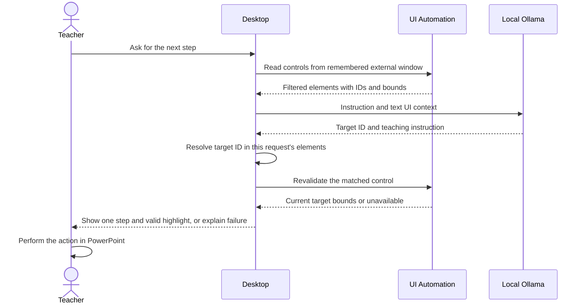

# Implementation notes

Product boundaries and acceptance criteria live in [product scope](PRODUCT_SCOPE.md) and [PRD](PRD.md). See [data model/ERD](DATA_MODEL.md) for the runtime objects and [validation plan](VALIDATION_PLAN.md) for planned evidence. These docs do not change the code or add persistence.

## Components and dependencies

| Project | Responsibility | References |
|---|---|---|
| `LocalTutor.Desktop` | WPF command palette, native shortcut, foreground context, mock tutor, Ollama boundary | Core |
| `LocalTutor.Core` | Serializable tutoring models and shared contracts | No application projects |
| `LocalTutor.Tools` | Typed utility base class, approved-file inspection/image conversion, video inspection/download | Core |
| `LocalTutor.Tests` | Focused tests for shared contracts and pure tool logic | Core, Tools |

Desktop targets `net10.0-windows`; Core, Tools, and Tests target `net10.0` because their shared logic does not require Windows. Add a Desktop → Tools reference only when the desktop needs a real utility. No database, web server, or additional framework is required.

## Current execution flow

1. Application startup captures the original foreground window handle before showing the assistant. WPF then creates the assistant and registers a native hotkey after its own window handle exists.
2. On each `Ctrl + Space`, the handler again captures the foreground window handle **before** showing and activating the assistant. It keeps the last external window if the assistant itself is foreground. A handle (`HWND`) identifies a native Windows window; future UI Automation must inspect that original window.
3. Input submission constructs a `TutorRequest` and calls `ILocalTutorService` asynchronously. The bootstrap implementation is visibly a mock and supplies no real captured UI elements.
4. The response is rendered in the assistant. No model, highlighting, or computer action occurs.
5. Escape hides only when the hotkey is registered. Closing exits; native registration and the message hook are cleaned up. If registration fails, the window remains reachable and reports the collision.

Ollama availability is a separate asynchronous status check. Failure must leave the mock assistant usable. Cancellation tokens let an operation stop when its caller no longer needs it; the UI thread must not block waiting for HTTP work.

### C# and WPF concepts used here

- A `record` holds a named data shape and provides value equality. These DTOs (data transfer objects) can be serialized to JSON without depending on WPF.
- An `interface` specifies what a service must provide. `App` supplies the mock implementation to the window's constructor; this is dependency injection without a container library.
- `Task<T>` represents an operation that produces a `T`. `await` lets the UI process input while an asynchronous operation waits. `string?` permits a missing string, such as no target ID.
- `TInput` and `TOutput` are generic type parameters: each tool chooses concrete input/output types. The interface's `in TInput` allows a tool accepting a broader input type to serve callers supplying a narrower subtype.
- XAML declares the controls; `x:Name` lets C# access a control. `IsDefault="True"` routes Enter to the submit button.
- `nint` holds a native-sized window handle. `DllImport` calls Windows functions from C#. `HwndSource.AddHook` receives `WM_HOTKEY` messages, and `Dispose` unregisters the shortcut when the window exits.

## Tutoring public API

Namespace: **`LocalTutor.Core`**.

| Contract | Members and meaning |
|---|---|
| `ScreenRectangle` | `Left`, `Top`, `Width`, `Height`, in physical screen pixels; negative left/top are valid on multi-monitor desktops |
| `UiElementSnapshot` | `Id`, `Name`, `ControlType`, `Bounds`, optional `IsEnabled`; IDs are stable within one snapshot, not across application changes |
| `TutorRequest` | `Instruction`, `ActiveApplicationName`, `Elements` |
| `TutorResponse` | Nullable `TargetElementId`, `Instruction`, `Success`, optional `Error` |
| `ILocalTutorService` | `Task<TutorResponse> GetNextStepAsync(TutorRequest request, CancellationToken cancellationToken = default)` |

A future response target must resolve to an element from the same captured snapshot before any highlight appears. The future highlight layer must convert physical pixels to WPF device-independent units using the appropriate monitor DPI. Never treat model-generated coordinates as validated screen geometry.

## Member 2: tool public API

Contracts are in **`LocalTutor.Core.Tools`**:

```csharp
public abstract record ToolInput
{
    public abstract IReadOnlyList<string> Validate();
}

public sealed record ToolResult<TOutput>(bool Success, TOutput? Value, string? Error = null);

public interface ILocalTool<in TInput, TOutput> where TInput : ToolInput
{
    string Id { get; }
    string Description { get; }
    Task<ToolResult<TOutput>> ExecuteAsync(TInput input, CancellationToken cancellationToken = default);
}
```

Implementation base: **`LocalTutor.Tools.LocalTool<TInput, TOutput>`**, constrained to `TInput : ToolInput`. Derive from it, define `Id` and `Description`, and implement `ExecuteValidatedAsync(TInput input, CancellationToken cancellationToken)`. Its public `ExecuteAsync` checks cancellation and validation before reaching your implementation. Validation returns all input errors; a nonempty list prevents execution.

Use a small typed input record and output record for each approved utility. Test invalid input, success, and cancellation in a tool-specific test file. A future caller must explicitly allow approved tool IDs and obtain appropriate confirmation before execution; the generic contract alone is not an authorization system. Do not add a string-based shell-command tool or a plugin discovery framework.

## File inspection and image conversion

Selected slice completed locally on `tool_calling_functions`: **`file.inspect` and `file.convert_image`**. The IDs match the planning directory's `TOOL_FUNCTIONS_INDEX.txt`. Both classes derive from the existing `LocalTool<TInput, TOutput>`; Core, Desktop, and project configuration are not part of this change. No registry exists and neither tool is callable through the assistant UI/model yet. The lead must wire an allowlist and effect-specific consent before any future integration; H guidance remains without tool execution.

### Typed arguments and results

Namespace: `LocalTutor.Tools.FileInspectionAndConversion`. Unknown JSON properties and missing required arguments are rejected. Validation checks undefined enum values, paths, dimensions, output extension, transparency, and quality before execution. `ToolResult<T>` returns success/value or a generic reason in `Error`, without native diagnostics or private input paths. Cancellation follows the existing contract by throwing `OperationCanceledException`; it is not reported as success.

| ID / class | Arguments | Result |
|---|---|---|
| `file.inspect` / `InspectFileTool` | `InspectFileInput`: required `InputPath` | `InspectedFile`: `DetectedType`, `Extension`, `SizeBytes`, nullable `Width`, `Height`, `PageCount`, `DurationSeconds`, `Verification` (`Decoded` or `SignatureOnly`), `SupportedNextActions`, `Warnings`. No input path/name, text, EXIF values, previews, or embedded content. |
| `file.convert_image` / `ConvertImageTool` | `ConvertImageInput`: required `InputPath`, `OutputPath`, `Format` (`Png`, `Jpeg`, `WebP`); optional `Transparency` (`Preserve` default or `FlattenWhite`), paired `MaxWidth`/`MaxHeight` (1–8192), `Quality` (1–100 for JPEG/WebP, default 85; not accepted for PNG) | `ConvertedImage`: actual `OutputPath`, `Format`, `SizeBytes`, `Width`, `Height`, `HasAlphaChannel`, `ColorHandling`, `Warnings`. Metadata and readability checked by decoding the actual encoded output. |

`FileAccessScope` and `ImageMagickCodec` are **trusted caller configuration**, separate from serializable model arguments. Construct a fresh scope after the user selects an existing workspace and approves the exact input and new output paths. Merely accepting a path in model output grants no permission. Never deserialize these configuration objects from model output. The caller owns approval freshness and cancellation, and must show the requested effect before dispatch.

`file.inspect` reads at most 32 signature bytes for other regular files. PDF, ZIP (Office subtype unverified), WAV, ISO base media, EBML, and ID3-tagged containers receive explicitly unverified signature labels; arbitrary files receive `Unknown`. Page count and duration remain null. Images with configured codecs are fully decoded for dimensions, bounded by the limits below. Extension/content mismatch, corrupt data, oversized images, and animation are rejected. Only decodable supported color spaces without ICC profiles offer `file.convert_image` as a next action. Without a configured codec, image inspection returns signature metadata with a warning and no available conversion action.

### Supported image matrix and bounds

| Source → output | PNG | JPEG | WebP |
|---|---|---|---|
| PNG | Tested | Tested | Tested |
| JPEG (`.jpg`/`.jpeg`) | Tested | Tested | Tested |
| WebP | Tested | Tested | Tested |

Only single still images are supported. APNG/WebP animation chunks and decoded multiple frames are rejected. Input limit: 20 MiB; output limit: 32 MiB; dimensions: at most 8192 on each side and 4 million decoded pixels. Resize fits the requested box, retains aspect ratio, and never enlarges. Native calls have a 15-second deadline each (up to three calls per conversion), one thread, a 128 MiB pixel-cache budget, and disabled mapped/disk pixel caches. Native process/runtime overhead is additional; these limits are not a hard OS memory quota. Standard output is bounded and native error text is discarded.

JPEG requires explicit `FlattenWhite` even for an opaque source. PNG/WebP can preserve alpha or flatten onto white. WebP alpha uses quality 100 independently of its lossy RGB quality. EXIF orientation is applied; conversion outputs 8-bit sRGB and removes metadata. RGB/sRGB/gray inputs are accepted; embedded ICC profiles and CMYK/other color spaces are rejected for conversion. This is not a color-managed print workflow. No fidelity, byte-for-byte pixel identity, visual-quality, or file-size-reduction guarantee is made. JPEG/WebP encoding and resizing can lose detail. Review the result.

Approvals are restricted to exact paths inside the selected workspace. Traversal, ambiguous paths, network/device/alternate-stream paths, filesystem-root workspaces, protected system locations, symbolic links, and reparse points are rejected. Output directories must exist; no source replacement, existing-file overwrite, batch conversion, or directory creation is exposed. Paths are rechecked before saving/publishing; a temporary sibling file is renamed with overwrite disabled after successful encoding/readability verification. Partial outputs are removed on failure/cancellation. The rename is the commit point: cancellation after it cannot undo the saved image.

The native worker receives only fixed arguments and image bytes, never a user filename or arbitrary command string. ImageMagick may spool stdin; each call uses an isolated OS temporary directory, deleted after worker exit including cancellation/timeout. Unix scratch permissions are owner-only; Windows uses the user's temporary-directory ACL. `CleanupFailed` reports inability to remove native scratch. This is ordinary cleanup, not secure erasure or crash recovery. No telemetry or file-content logging is added.

These managed path checks are not a race-free OS sandbox. Use ordinary local files in a workspace whose directories cannot be concurrently replaced by an untrusted process. Approval expiry/revocation, hostile directory races, special Unix files/network mounts, Windows junctions and ACLs, and crash recovery require integration/device hardening before wider exposure.

### Local dependency setup and teacher handoff

ImageMagick is the only directly invoked dependency. Tests used installed **6.9.12-98 Q16 x64** with libpng 1.6.43, libjpeg-turbo 2.1.5, libwebp 1.3.2 and zlib 1.3. Installed package copyright/license records were inspected locally; no download or cloud conversion was used. The separate planning inventory `Tool_Calling_Prompts/OPEN_SOURCE_TOOLS_USED.txt` records versions, official URLs, licenses, packaging and attribution obligations for the selected native dependency and codec delegates. No NuGet dependency was added. No native binary is bundled; a Windows binary/codec/policy/security-maintenance choice and its bundled licenses remain to be verified on the actual device. ImageMagick 7's `magick.exe` path is accepted as host configuration, but only the stated version 6 build has been tested.

Configure the absolute installed `magick.exe` (or ImageMagick 6 `convert.exe`) path in the trusted caller; do not rely on PATH or Windows' unrelated `convert.exe`. Missing/unstartable dependencies return `MissingDependency`, unavailable codecs/policy/corrupt data return `CodecFailed`, and deadlines return `TimedOut`. No installation or dependency download is automatic. Header-only `InspectFileTool` can be used without ImageMagick.

Example after the teacher has approved one water-cycle illustration and the exact new name:

```csharp
string workspace = @"C:\Classroom\LessonAssets";
var scope = new FileAccessScope(workspace,
    approvedInputs: ["water-cycle.webp"],
    approvedOutputs: ["water-cycle-slides.png"]);
var codec = new ImageMagickCodec(trustedInstalledImageMagickPath);
var inspected = await new InspectFileTool(scope, codec)
    .ExecuteAsync(new InspectFileInput("water-cycle.webp"), cancellationToken);
// Present the requested new file/format to the user and confirm before dispatch.
var converted = await new ConvertImageTool(scope, codec, progress)
    .ExecuteAsync(new ConvertImageInput("water-cycle.webp", "water-cycle-slides.png",
        ImageFormat.Png, TransparencyMode.Preserve, MaxWidth: 1600, MaxHeight: 900), cancellationToken);
```

Check `Success` and use the returned output path. The teacher reviews the new PNG and inserts it manually through the presentation app's file picker. This demonstrates file preparation only; PowerPoint insertion/acceptance and the main tutoring flow are not verified by these tests.

### Planned functions: no executable implementation or advertised availability

| Exact ID | Proposed bounded argument/result shape for coordination | Remaining work |
|---|---|---|
| `file.convert_document` | Required approved `InputPath`, new approved `OutputPath` ending `.pdf`; input content/extension allowlist DOCX/PPTX/XLSX. No converter options from the model. Result: actual PDF path, byte size, verified page count and fidelity/font/layout warnings. | Installed LibreOffice remains a candidate, not an adopted dependency. Requires isolated local conversion, missing-dependency/font handling, process/output/resource limits, real PDF readability and Office fixture checks. No PDF-to-editable-Office conversion promise. |
| `file.convert_media` | Required approved `InputPath`, new approved `OutputPath`, target enum (`Mp4`, `WebM`, `Mp3`, `Wav`), preset enum (`Small`, `Balanced`, `HighQuality`); caller cancellation and progress. Result: actual path, format, size, verified duration/streams and warnings. No raw FFmpeg flags. | FFmpeg remains a candidate, not an adopted dependency. Video MP4/WebM and audio MP3/WAV matrices/presets are proposals, untested and unavailable; require explicit codec/build licenses, stream selection, metadata sanitization, fixed flags, limits and real decoded output checks. |

### Verification and changed C# files

Linux Mint 22.3, .NET SDK 10.0.112: all **24 focused utility cases / 27 repository tests** pass with real local codecs. The Tools project build with `--no-restore -warnaserror` passes with zero warnings/errors; `git diff --check` passes. Coverage includes the nine source/output pairs with raw RGBA readability, dimensions/resize, alpha preservation and JPEG white compositing, metadata removal/privacy, malformed/truncated/mismatched/animated/oversized files, ICC-marker/CMYK rejection, missing dependencies, strict JSON/arguments, approvals/traversal, existing/source/late output conflicts, symlinks introduced before saving, cancellation, native timeout/process exit and scratch cleanup. The deliberately incomplete ICC fixture tests rejection; it does not verify profile fidelity. POSIX worker/symlink fixtures do not execute on Windows; tests on Windows require the native dependency and separate junction/process-tree checks. No WPF smoke check, actual presentation-tool acceptance, native Windows run or model integration was performed in this slice.

```powershell
# Windows test configuration (must point to an already installed trusted binary):
$env:LOCAL_TUTOR_IMAGEMAGICK = 'C:\path\to\ImageMagick\magick.exe'
dotnet test tests/LocalTutor.Tests/LocalTutor.Tests.csproj --no-restore --filter FullyQualifiedName~FileInspectionAndConversion
dotnet test tests/LocalTutor.Tests/LocalTutor.Tests.csproj --no-restore
dotnet build src/LocalTutor.Tools/LocalTutor.Tools.csproj --no-restore -warnaserror
```

Tests use synthetic fixtures and temporary directories, with no external transfer. Existing package restore assets were used offline. New source files (all under `src/LocalTutor.Tools/FileInspectionAndConversion/`): `FileToolContracts.cs`, `FileAccessScope.cs`, `ImageContent.cs`, `ImageMagickCodec.cs`, `InspectFileTool.cs`, `ConvertImageTool.cs`. New focused test file: `tests/LocalTutor.Tests/FileInspectionAndConversion/ImageToolTests.cs`. Documentation updates: this file and the existing root README. The unrelated pre-existing Desktop project edit is excluded. Before commit, the handoff and inventory must be current and both author/committer must be the user-confirmed identity; this prompt permits no push or publication.

## Video inspection and download

Completed local library slice on `tool_calling_functions`: **`video.inspect_url` / `InspectVideoTool`** and **`video.download` / `DownloadVideoTool`**, with the exact IDs from `TOOL_FUNCTIONS_INDEX.txt`. Both reuse `LocalTool<TInput,TOutput>` and its `ILocalTool` contract. New implementation files are confined to `src/LocalTutor.Tools/VideoDownload/`; focused tests are in `tests/LocalTutor.Tests/VideoDownload/`. Core, Desktop and project configuration were not changed. These online tools have no cloud AI dependency and are not available through the desktop or a model registry.

### Arguments, results and host consent

Namespace: `LocalTutor.Tools.VideoDownload`. Required JSON arguments and unknown-property rejection follow the existing file-tool conventions. Errors are generic codes/messages in `ToolResult.Error`; native diagnostics, cookies and media URLs are never returned. Cancellation throws `OperationCanceledException`.

| ID | Typed arguments | Result |
|---|---|---|
| `video.inspect_url` | `InspectVideoInput(Url)` | `InspectedVideo`: title, nullable duration seconds, source service, relevant `VideoFormatChoice` entries and warnings. Each choice has quality, container, actual height, nullable estimated bytes and `RequiresFfmpeg`. No raw metadata, cookies, history or CDN URLs. |
| `video.download` | `DownloadVideoInput(Url, DestinationPath, Quality)` | `DownloadedVideo`: actual local path, container, bytes and status (`Completed`, or `CompletedWithCleanupWarning` if the saved media exists but its empty staging directory could not be removed). Failures publish no new file; a cancellation after the final rename cannot undo that saved file. |

Allowlisted qualities are `Mp4_360p`, `Mp4_720p`, and `WebM_720p`. They mean a maximum height, not a promise that the source offers exactly that resolution. The selected format is deterministic by height, size and validated native format identifier. Combined HTTPS audio/video is accepted directly. With configured, pinned FFmpeg, separate MP4 + M4A or WebM + WebM HTTPS streams can be merged into one file without re-encoding. HLS, DASH fragment transports, audio-only outputs, conversion and upscaling are disabled. Estimates may be unavailable and do not guarantee the final size.

`YtDlpClient`, the selected workspace, the exact inspection URL approval, and `VideoDownloadApproval` are **trusted host configuration**, never model arguments. A caller must obtain the user's URL and rights confirmation; public access does not establish permission to download. The preview helper performs metadata inspection only and does not authorize a download:

```csharp
var client = new YtDlpClient(trustedYtDlpPath, trustedFfmpegPath); // Optional second path.
var inspection = await new InspectVideoTool(client, userSelectedUrl)
    .ExecuteAsync(new InspectVideoInput(userSelectedUrl), cancellationToken);
var input = new DownloadVideoInput(userSelectedUrl, userSelectedNewPath, userSelectedQuality);
var preview = await DownloadVideoTool.PreviewAsync(client, input, userSelectedWorkspace, cancellationToken);
// Check Success. Display the selected URL, preview.Value.Source, Title, DurationSeconds,
// Filename, Format (including estimated bytes), and DestinationPath; obtain explicit approval and rights confirmation.
// Only after that confirmation, construct trusted consent and dispatch once:
var consent = new VideoDownloadApproval(preview.Value!);
var downloaded = await new DownloadVideoTool(client, consent, progress)
    .ExecuteAsync(input, cancellationToken);
```

Approval expires after five minutes and is consumed by one attempt, including a failed attempt. A changed URL, quality, destination, metadata, or selected format requires a new preview and confirmation. The destination must be a new absolute local filename within the user's selected existing workspace. The existing `FileAccessScope` is reused without modification for exact output approval, traversal/protected-path/reparse-point checks and conflict prevention. ASCII MP4/WebM filenames exclude native template metacharacters and reserved device names. The native worker receives a fixed staging filename; the user filename never enters native arguments. No overwrites or output-directory creation are exposed.

### Local dependencies and limits

Configure an absolute trusted `yt-dlp` / `yt-dlp.exe` path. The only admitted yt-dlp version is **2026.08.19**; the old system `2024.04.09` is rejected. Optional FFmpeg must be named `ffmpeg` / `ffmpeg.exe`, supplied by absolute trusted path, and report **9.0.1**. Missing yt-dlp is an execution error. Missing/unconfigured FFmpeg is reported as a warning and suppresses choices requiring a merge; a configured version mismatch is rejected before source access. No binary download/update occurs inside a function, and ambient FFmpeg lookup on PATH is disabled. Upstream yt-dlp may discover an ffprobe companion beside the explicitly configured FFmpeg; trust that directory as part of the same verified distribution. Version strings are checked on each inspection/reinspection; the installer/host must verify provenance/checksums and protect native files from replacement.

For this session, the user specifically approved obtaining the official release and two sample URLs. The Linux zipimport `yt-dlp` release was stored outside the repository in local native-tool storage; its SHA-256 matched the release's `SHA2-256SUMS`: `1fa6733c37ea6fb51c99ad8fe785e7b7e5f3246c9b980230329d4fb72ed8d4d6`. This checksum is for that Linux asset, not Windows `yt-dlp.exe`; no GPG-signature verification is claimed. The tested interpreter was preinstalled Python 3.14.7. FFmpeg 9.0.1 was already installed. All C# logic uses built-in .NET APIs; no NuGet dependency was added. Dependencies and runtime/license details are recorded in the planning directory's existing `OPEN_SOURCE_TOOLS_USED.txt`, outside this repository's commit.

Native invocation uses `UseShellExecute=false`, `ProcessStartInfo.ArgumentList`, a fixed executable and fixed switches, with only the validated selected URL and bounded native format IDs added. yt-dlp configuration, plugins, remote components, JS runtimes, browser cookies, cookie files, cache, proxies, netrc opt-in, geo bypass and command hooks are disabled/omitted. No authentication, paywall/DRM bypass, search, playlist or bulk interface exists. Live/upcoming, DRM, age-restricted and non-public metadata is rejected. Source terms and rights remain the user's responsibility.

Accepted input shapes are HTTPS YouTube `/watch?v=<11-character-ID>`, `youtu.be/<ID>`, numeric public Vimeo video URLs, and direct MP4/WebM paths under `upload.wikimedia.org/wikipedia/commons/`. YouTube extra query parameters and playlist URLs are rejected. The source and selected video/audio CDN DNS answers must all be public addresses. Selected CDN hosts are restricted to Googlevideo, Vimeo CDN/Akamai, or Wikimedia according to the source. Extractors are restricted per source. These checks are **not an OS network sandbox**: yt-dlp performs its own later DNS resolution and API/redirect requests, so rebinding and every downstream request are not comprehensively blocked. Expand source coverage only with coordinated egress enforcement and additional tests.

Limits: one download, at most **600 seconds** and **100 MiB** final output; total staging files are also sampled against 100 MiB every 100 ms, with a native 4 MiB/s rate setting. Merging temporarily retains streams plus output and may hit the staging cap even if the final file would fit. The sampled staging cap is not a hard filesystem quota and can transiently overshoot; no output above 100 MiB is published. DNS checks have five-second deadlines, native version checks five seconds each, metadata calls thirty seconds, and one download/merge three minutes. A preview and execution each reinspect; total workflow time includes those calls. Native output is limited to 2 MiB for metadata and smaller budgets for version/completion output. stderr is drained and discarded, not logged.

Partial files use a private staging directory next to the approved destination, removed on failure/cancellation. The completed file's size and MP4 `ftyp` / WebM EBML signature are checked before a rename with overwrite disabled. This is container-signature verification, not complete media decoding or a playback/codec compatibility guarantee. Unknown duration disables downloading while metadata inspection still succeeds; videos over the duration limit can also be inspected with a download-limit warning. Progress reports stage, bytes and estimated bytes, without URLs or paths. Native runtime memory has no hard OS quota. Ordinary-user path checks do not defeat a concurrent attacker swapping filesystem components; isolated host permissions remain necessary.

### Verification and manual handoff

On Linux with .NET SDK **10.0.112**, **87 focused offline cases** passed, including stub metadata/process output, consent mismatch/expiry/replay, URL and DNS rejection, native output limits, cancellation, malformed metadata, DRM/access restrictions, dependency/version failures, combined/WebM/merge outputs, output conflicts, boundary/symlink checks and partial cleanup. The optional installed-binary test also verified the fixed yt-dlp switches through its actual parser without network. **All 114 repository offline cases passed**, with the one live test skipped. Tools built with `-warnaserror`: zero warnings/errors. Existing restore assets were reused with `--no-restore`.

The separately approved live check passed for a **205-second user-selected YouTube video**, including inspection, preview, fresh consent, MP4 download/FFmpeg merge, actual byte count/path verification and cleanup. The earlier approved sample exceeded the ten-minute cap and was not downloaded. The URLs and video titles are deliberately absent from repository documentation. This proves one Linux source/format case; Vimeo, Wikimedia, live WebM and Windows native/FFmpeg execution have not been verified. No desktop/model integration or playback acceptance is claimed.

```powershell
# Offline; LOCAL_TUTOR_YTDLP optionally enables the native option-parser check only.
dotnet test tests/LocalTutor.Tests/LocalTutor.Tests.csproj --no-restore --filter FullyQualifiedName~VideoDownload
dotnet test tests/LocalTutor.Tests/LocalTutor.Tests.csproj --no-restore
dotnet build src/LocalTutor.Tools/LocalTutor.Tools.csproj --no-restore -warnaserror
```

Manual lawful-sample check, **only after specific user approval of this test and URL**: choose a publicly accessible video the user has rights to download, under ten minutes, with an offered MP4/WebM format. Configure trusted, verified binaries; display/approve the preview; cancel an attempt and check for partials; retry only with fresh consent. Check the returned path, byte count, container and local playback on the intended demo device. For the automated temporary sample check, set `LOCAL_TUTOR_YTDLP`, optional `LOCAL_TUTOR_FFMPEG`, `LOCAL_TUTOR_APPROVED_VIDEO_URL`, and `LOCAL_TUTOR_APPROVED_LIVE_VIDEO_TEST=1`, then run `dotnet test tests/LocalTutor.Tests/LocalTutor.Tests.csproj --no-restore --filter FullyQualifiedName~ApprovedLiveVideoTests`. It creates/removes a temporary directory inside the video test directory. Unset the approval variables afterward. These variables belong to the test harness, not application settings or an authorization mechanism.

Lead handoff: allowlist the exact IDs, supply trusted native paths and host-owned user approval, display the preview and source URL before dispatch, propagate cancellation/progress, handle failures/cleanup warnings, and qualify the installed Windows binaries and playback before advertising the tools in the UI. No Core contract change is needed for this library slice. The user-confirmed author/committer is `KampferArchives <eleneusgyen@gmail.com>`; `gh auth status` confirmed that GitHub account is active. Commit only this prompt's source/tests and existing documentation; exclude the pre-existing Desktop project edit, native binaries, temporary media and the separate planning inventory. No push/publication is authorized.

Dependency references: [yt-dlp release](https://github.com/yt-dlp/yt-dlp/releases/tag/2026.08.19), [yt-dlp licensing and installation](https://github.com/yt-dlp/yt-dlp#licensing), [bundled dependency notices](https://github.com/yt-dlp/yt-dlp/blob/2026.08.19/THIRD_PARTY_LICENSES.txt), [FFmpeg legal/build conditions](https://ffmpeg.org/legal.html). Upstream yt-dlp source is Unlicense; official PyInstaller executable distributions contain GPLv3+ code. FFmpeg's license depends on its build; the tested build enables GPL and version 3. No native redistribution is included here.

## Ollama boundary

`src/LocalTutor.Desktop/Services/OllamaSettings.cs` owns the source defaults: `http://localhost:11434` and `qwen3:1.7b`. Rebuild after editing them. No settings file, environment loader, automatic install, or model download is wired up.

`IOllamaClient` currently exposes the availability boundary only. Its HTTP implementation checks `GET /api/version` asynchronously; this is not model inference and does not prove a model is installed. Future inference can extend this boundary after benchmarking without coupling Core or Tools to HTTP or WPF.

## Small checkpoints

1. **Bootstrap (current):** solution, mock assistant, shortcut, shared contracts, availability plumbing, docs, and repository.
2. **Next milestone only:** benchmark local `qwen3:1.7b` and collect/filter one bounded UI Automation snapshot. Agree on output validation before building the end-to-end tutor.

Technical risks to measure: unavailable accessibility controls, changing/stale UI snapshots, mixed-DPI monitors, hotkey collisions, foreground activation restrictions, and local-model latency/target accuracy. No benchmark or broad application support is currently established.

### Intended tutoring sequence (not implemented)



The present scaffold takes the separate mock path described above. The diagram is the intended data flow for the next product slice, not a record of working inference or UI Automation.

Verification commands and manual checks are in [README](../README.md). Restore and build passed with no warnings or errors; all 3 automated tests passed. A Windows 11 build `26200` interactive smoke check passed 22 assertions at 125% display scaling, covering launch/focus, input validation, Submit/Enter, Hide/Escape, the actual global shortcut, collision handling, graceful exit, and immediate hotkey re-registration after exit. The assistant remained usable without Ollama. Screenshot review found no clipping. Windows 10 and mixed-DPI behavior remain untested; product UI Automation, inference, and highlighting remain unimplemented.

References: [Windows UI Automation overview](https://learn.microsoft.com/en-us/dotnet/framework/ui-automation/ui-automation-overview), [RegisterHotKey](https://learn.microsoft.com/en-us/windows/win32/api/winuser/nf-winuser-registerhotkey), [Ollama API](https://github.com/ollama/ollama/blob/main/docs/api.md).

## Bootstrap file inventory

The original bootstrap contained the 30 files below. This is a historical inventory; subsequent product documents are listed in [the documentation index](README.md). No pre-existing application files were modified or deleted during scaffolding. Temporary generated `Class1.cs` files in Core/Tools and `UnitTest1.cs` were discarded before the initial commit. Build outputs and IDE caches are excluded by `.gitignore`.

| File | Purpose |
|---|---|
| `.editorconfig` | Consistent formatting conventions |
| `.gitattributes` | Repository line-ending conventions |
| `.gitignore` | Exclude builds, IDE caches, temporary files, and secrets |
| `global.json` | Select a stable .NET 10 SDK |
| `LocalTutor.slnx` | Group the four projects |
| `README.md` | Setup, verification, limitations, and onboarding entry point |
| `docs/PRD.md` | Audience, product scope, and acceptance targets |
| `docs/IMPLEMENTATION.md` | Architecture, contracts, flow, and this inventory |
| `docs/HACKATHON_COMPLIANCE.md` | Disclosures, submission checklist, unresolved rules |
| `docs/TEAM_TASKS.md` | Ownership, branches, contributor workflow |
| `src/LocalTutor.Core/LocalTutor.Core.csproj` | Shared .NET library project |
| `src/LocalTutor.Core/TutorContracts.cs` | Screen bounds, UI snapshots, tutor request/response/service |
| `src/LocalTutor.Core/Tools/ToolContracts.cs` | Typed utility input/result/interface |
| `src/LocalTutor.Tools/LocalTutor.Tools.csproj` | Utility library and Core reference |
| `src/LocalTutor.Tools/LocalTool.cs` | Validate and check cancellation before utility execution |
| `src/LocalTutor.Desktop/LocalTutor.Desktop.csproj` | Windows WPF executable and Core reference |
| `src/LocalTutor.Desktop/App.xaml` | WPF application resources and lifetime settings |
| `src/LocalTutor.Desktop/App.xaml.cs` | Startup foreground capture, dependency wiring, HTTP lifetime |
| `src/LocalTutor.Desktop/AssemblyInfo.cs` | WPF resource-theme assembly metadata |
| `src/LocalTutor.Desktop/MainWindow.xaml` | Compact assistant controls and dark styling |
| `src/LocalTutor.Desktop/MainWindow.xaml.cs` | Submit, focus, status, hide, close, and process context |
| `src/LocalTutor.Desktop/Interop/NativeMethods.cs` | Typed native Windows API declarations |
| `src/LocalTutor.Desktop/Interop/GlobalHotkey.cs` | Register/receive/unregister shortcut and capture foreground HWND |
| `src/LocalTutor.Desktop/Services/IOllamaClient.cs` | Async local-runtime availability boundary |
| `src/LocalTutor.Desktop/Services/OllamaSettings.cs` | Central source defaults for local URL/model |
| `src/LocalTutor.Desktop/Services/OllamaAvailabilityClient.cs` | Nonblocking version-endpoint availability check |
| `src/LocalTutor.Desktop/Services/MockTutorService.cs` | Explicitly labeled mock submission response |
| `tests/LocalTutor.Tests/LocalTutor.Tests.csproj` | Test dependencies and Core/Tools references |
| `tests/LocalTutor.Tests/TutorContractsTests.cs` | Shared tutoring-contract verification |
| `tests/LocalTutor.Tests/LocalToolTests.cs` | Tool validation and cancellation verification |
